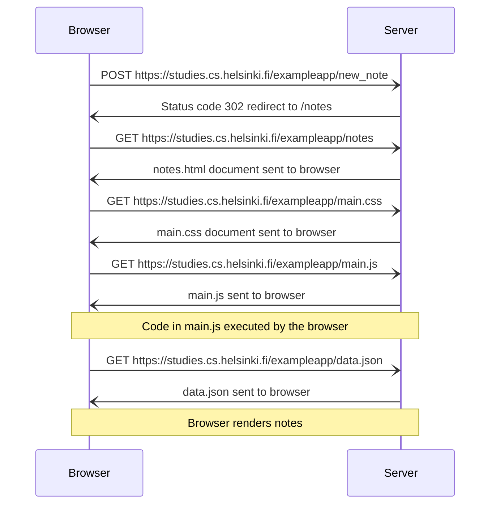

```mermaid
sequenceDiagram
Browser-)Server: POST https://studies.cs.helsinki.fi/exampleapp/new_note
Server-)Browser: Status code 302 redirect to /notes
Browser-)Server: GET  https://studies.cs.helsinki.fi/exampleapp/notes
Server-)Browser: notes.html document sent to browser
Browser-)Server: GET https://studies.cs.helsinki.fi/exampleapp/main.css
Server-)Browser: main.css document sent to browser
Browser-)Server: GET https://studies.cs.helsinki.fi/exampleapp/main.js
Server-)Browser: main.js sent to browser
Note over Browser,Server: Code in main.js executed by the browser
Browser-)Server: GET https://studies.cs.helsinki.fi/exampleapp/data.json
Server-)Browser: data.json sent to browser
Note over Browser,Server: Browser renders notes
```
