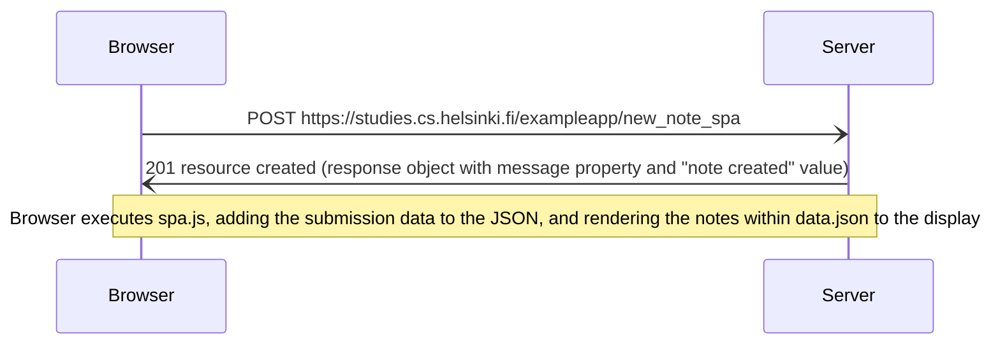

```mermaid
sequenceDiagram
Browser-)Server: POST https://studies.cs.helsinki.fi/exampleapp/new_note_spa
Server-)Browser: 201 resource created (response object with message property and "note created" value)
Note over Browser,Server: Browser executes spa.js, adding the submission data to the JSON, and rendering the notes within data.json to the display
```
